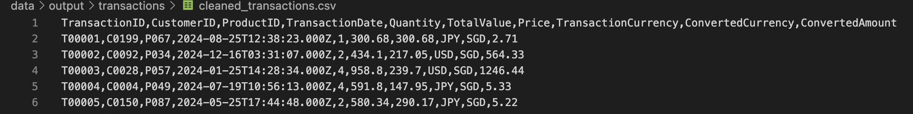

# ETL Job on AWS Glue

This repository contains a simple ETL (Extract, Transform, Load) job implemented on AWS Glue. The job processes transaction data with the following steps:

1. **Load Transactions**: Extracts transaction data from the source.
2. **Remove Duplicates**: Cleans the data by removing duplicate records.
3. **Currency Conversion**: Converts transaction amounts to SGD (Singapore Dollar).
4. **Flag High-Risk Transactions**: Identifies and flags transactions that are considered high risk. >$SGD 10,000

## Usage

1. Configure the AWS Glue job with the appropriate source and target locations.
2. Deploy the [job script](main.py) to AWS Glue.
3. Run the job and monitor its progress in the AWS Glue console.
4. Sample [cloudformation](cloudformation.yaml) is attached to show the necessary permission required for the glue job to run

## Limitations
- The S3 bucket name is hardcoded in the script, which reduces flexibility.
- The script assumes all input data is in a specific format. Any deviation from this format may cause errors.
- Limited error handling is implemented, which may lead to job failures in case of unexpected issues.
- The currency conversion step only supports conversion to SGD. Additional currencies would require modifications to the script.
- High-risk transaction flagging logic is predefined and may not cover all use cases.
- The job does not include automated testing or validation of the output data.
- Requires manual deployment and configuration in AWS Glue.

## Screenshots

* Input file - Transactions.csv

* ETL job on AWS Glue

* Output generated by ETL job

* Cleaned tranasctions

* High risk transactions
